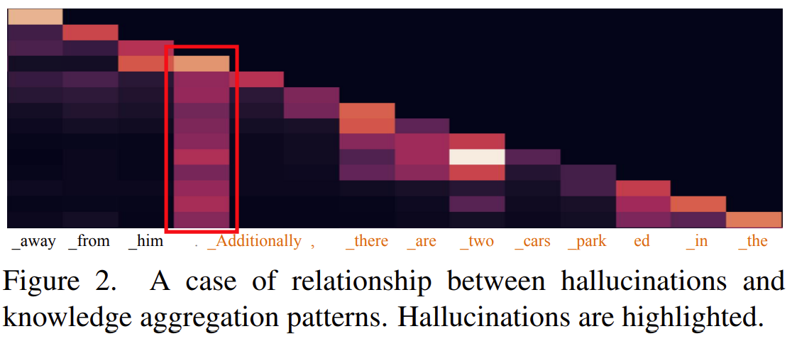
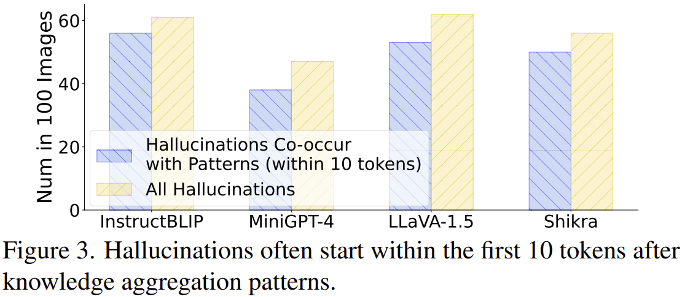
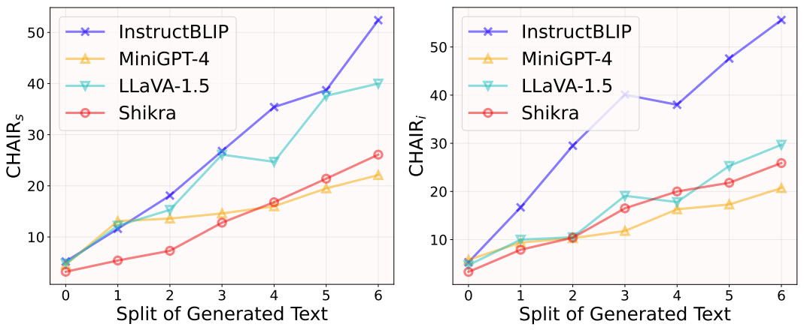
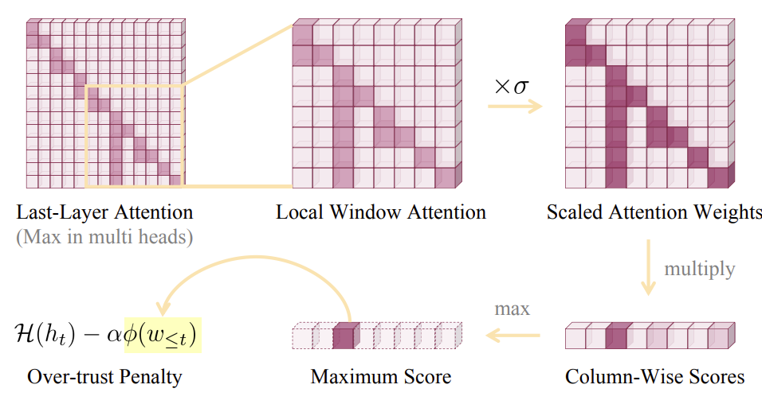
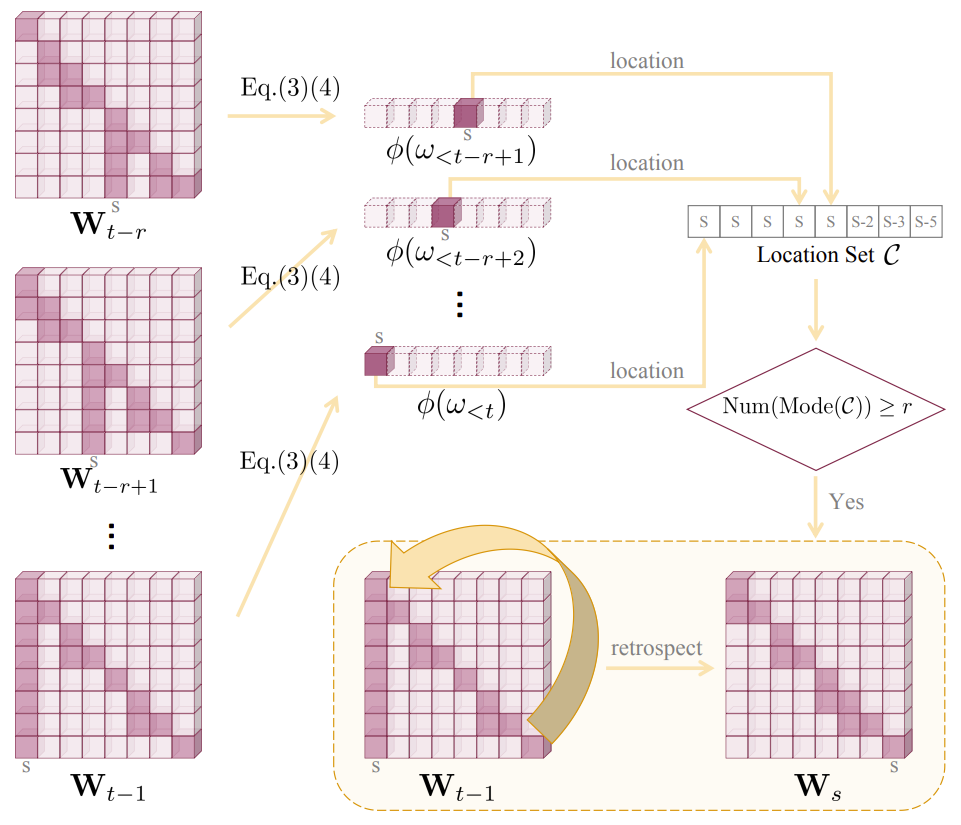

## OPERA : over-trust penalty and retrospection-allocation

### Attention 和 Cross-Attention

最简单的 **Self-Attention**中，我们从$Q$，$K$，$V$谈起。
对于input tokens $X \in \mathbb{R}^{N\times d_{model}}$。
我们首先会通过三个权重矩阵计算得到相应的$Q$，$K$，$V$：
$$
Q = XW_Q \\
K = XW_K \\
V = XW_V
$$
其中$W_Q\in\mathbb{R}^{d_{model}\times{d_k}}$，$W_K\in\mathbb{R}^{d_{model}\times{d_k}}$，$W_V\in\mathbb{R}^{d_{model}\times{d_v}}$，通常为实现方便令$d_k=d_v$。
之后得到Attention矩阵：
$$
Attention(Q, K, V) = \text{softmax}(\frac{QK^T}{\sqrt{d_k}})V
$$
其中$QK^T \in \mathbb{R}^{N\times N}$由于$Q$和$K$都来自$X$，因此可以表示tokens之间的相关性。
将计算公式做如下修改，便得到了**Cross-Attention**：
$$
Q = X_tW_Q \\
K = X_eW_K \\
V = X_eW_V
$$
其中$X_t$表示decoder hidden states，即目前已经生成的tokens，$X_e$表示encoder output。
而在**跨模态的Cross-Attention**中，通过文本tokens$X_t$得到$Q$，视觉tokens$X_v$得到$K$和$V$，同时一般只更新$X_t$，而$X_v$在整个模型中保持不变，或通过**Self-Attention**更新。

### Columnar Attention Pattern

这篇文章从一个在`self-attention`反复出现的奇怪现象——**柱状注意力模式**开始分析，对$A = \text{softmax}(\frac{Q\times K^T}{\sqrt{d_k}})$可视化，如下图所示。

这种现象往往发生在缺少信息的token，如句号、引号等，先前的信息在这些token处发生聚合，即其他token对于该token的attention始终较强，但单一的token难以承载之前多个token的信息密度与丰富程度，绝大部分幻觉会发生在这一聚合模式出现后的10个token内。

这种聚合模式在LLM中十分常见。一种假设是，发生这个现象的token，起到的是总结之前的tokens，并指导后续tokens生成的作用，这些tokens被称作**summary token**。这和NLP领域中观测到的一致，即LLM在浅层中，会在一些 `anchor token` 总结先前的信息，并在深层中依靠这些 `anchor token` 生成下一个token。

这种聚合模式的出现和MLLM幻觉有强相关性。

### Greedy 和 Beam Search
从数学形式看来，生成序列实际上就是**寻找概率最大的序列**，形式化地表示如下：
$$
\arg \max_y P(y | x)
$$
其中$P = \prod_{t = 1}^{T} P(y_t)$，为避免下溢常使用$\log P = \sum_{t = 1}^{T} P(y_t)$ 。
贪心的方法就是在生成每个token时，总选择概率最大的token，但局部最优往往不是全局最有。
但遍历整个空间的代价是不可接受的，因此，在效果和计算量的权衡中，就有了**Beam Search 束搜索**方法。
Beam Search中需要一个**beam size 束宽**，即最多保留beam size个候选项，每个候选项是一个token序列，每次将所有候选项进行生成，将每个候选项的前beam size的token和原候选项整合后，得到beam size再作为新的候选项，再保留概率乘积较大的前beam size个候选项，以此循环。
其实考虑Beam search的过程，会发现这是一个概率不断相乘，来筛选较优选项的方法，那么更长和更短的句子中，更短的句子概率往往更大，所以原始的beam search会**更偏向短句**。
往往会使用 Length Normalization 的方法，适当地平衡长短句，具体如下：

$$
\begin{aligned}
score = \frac{\log P}{T ^ \alpha}
\end{aligned}
$$

### Over-trust Penalty and Retrospecion-Allocation
在decode过程中，对每个候选项都进行评估，对over-trust的候选项进行惩罚，降低over-trust被选择的概率，即**over-trust penalty**。但可能在当前token生成之前，已经出现聚合模式，因此要支持对self-attention进行“回滚”，重新回到summary token选择其他候选项，即**retrospection allocation**。

在常见的 MLLM 中，往往通过**visual decoder**将视觉特征转化为视觉tokens，进一步通过**跨模态的映射模型**，映射到 LLM 的input space中，之后和文本tokens的embedding vector一起作为输入。形式化的有：

$$
\begin{aligned}
&\text{x}^v = \{x_0, x_1, \ldots, x_{N-1}\} \\
&\text{x}^p = \{x_N, x_{N+1}, \ldots, x_{N+M-1}\}
\end{aligned}
$$
最终的input sequence是$\{x_i\}_{t=0}^{T-1}$
在forward过程中，有：
$$
\begin{aligned}
&\textbf{h}=MLLM(\textbf{x}) \\
&\textbf{h}=\{h_0, h_1, \ldots, h_{T-1}\}
\end{aligned}
$$
所以下一个token的预测就是：
$$
p(x_t|x_{<t})=\text{softmax}(\mathcal{H}(h_t))_{x_t}
$$
最终通过不同的解码策略，选择生成的token，并加入input text的末尾，进行下一轮生成。

聚合模式在summary token生成时，并不能看出来，但经过几个token生成之后，这一模式就会变得明显。

如何评估是否发生columar attention pattern？

一个直觉的想法就是将每一列的self-attention的权重相乘，如果某一列的权重异常大，就是发生聚合现象。文章中就是这样做的，首先在**generated tokens**的self-attention中，选取了一个边长为$k$的正方形窗口，作为判断聚合模式的范围。同时对于多头注意力的情况，**会选择attention权重最大的头**归一化后作为研究对象。
形式化来说：
$$
\textbf{W}_{t-1}^{k} = \{\textbf{w}^i\}_{i=t-k}^{t-1}, \quad s.t. \textbf{w}_i = \{ \sigma w_{i,j}\}_{i=t-k}^{i}
$$
其中$\sigma$是扩大系数。然后将每一列的权重相乘作为指标，**选择最大乘积**，用来评估聚合模式的强度。
$$
\phi(\omega_{<t}) = \prod_{i=c}^{t-1} \sigma \omega_{i,c}, 
\quad \text{s.t.} \quad 
c = \arg\max_{t-k \le j \le t-1} \prod_{i=j}^{t-1} \sigma \omega_{i,j}
$$
进而将$\phi(w_{<t})$作为惩罚项，惩罚选择相应token的项，即：
$$
p(x_t|x_{<t}) = \text{softmax}(\mathcal{H}(h_t) - \alpha\phi(w_{\le t}))_{x_t}, \quad s.t. x_t \in \mathcal{Y}
$$
其中$\phi(w_{\le t})$表示由待选token整合得到的tokens序列的attention权重。
整体流程如下图所示：

但由于聚合模式的发现具有滞后性，很可能即使尽力惩罚具有聚合模式的项，仍然无法打破前期就已经形成的聚合，因此我们需要一种"回滚"操作。
重新思考聚合模式出现的原因，很可能是summary token后的某些token过于信任summary，但没有被penalty排除掉。想要解决这种情况，实际上我们只需要排除掉这些token，并重新选择其他token就能尝试解决，这就是**Retropection Allocation**。形式化地表述如下：
$$
\mathcal{C} = \{c|c=\argmax_{t-k\le j \le z} \prod_{i=j}^{z} \sigma w_{i,j}, z\in [t-l, t-1] \}
$$
即从attention的右下角开始，依次选择边长为$k, k-1, \ldots, 1$的正方形窗口向左上角移动，分别进行聚合模式的评估，并记录最大列权重乘积的列号，通常设置$l=k$。
定义作为最大权重乘积次数最多的列对应的次数为$N_{overlap}$，具体公式如下：
$$
N_{overlap} = \sum_{c\in\mathcal{C}}\mathbb{1}_{c=s} \quad s.t. \quad s=Mode(\mathcal{C})
$$
其中$\mathbb{1}$表示真值函数，$Mode(\mathcal{C})$表示一个$\mathcal{C}$集合中的众数。
若$N_{overlap} \ge r$，则会发生 **retrospection 回顾**，返回生成token s的位置重新选择其他tokens，同时总的回滚次数有上限$\beta$，如果返回$s$的次数超出了$\beta$，则会返回$s-1$。
具体流程如下图：

