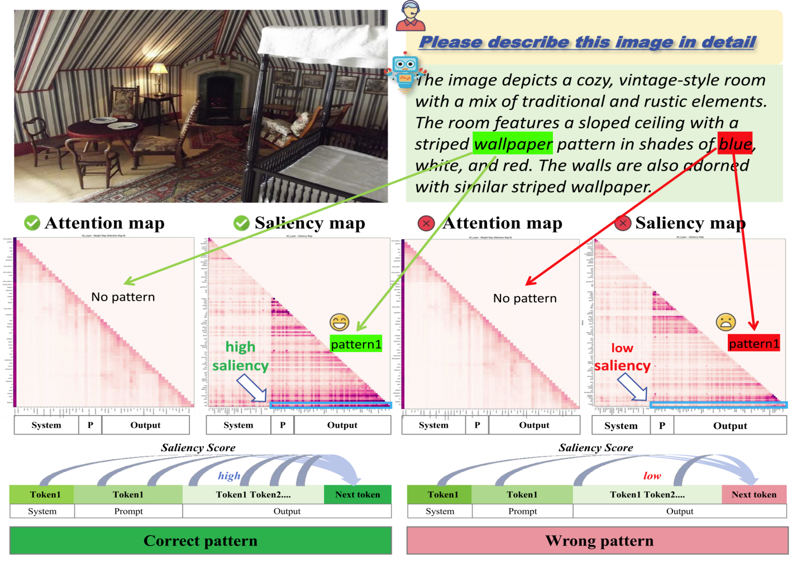
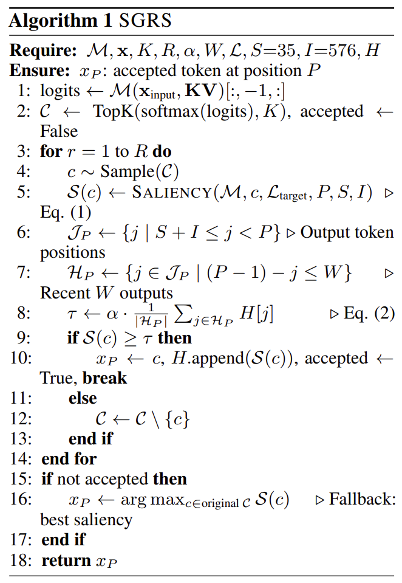
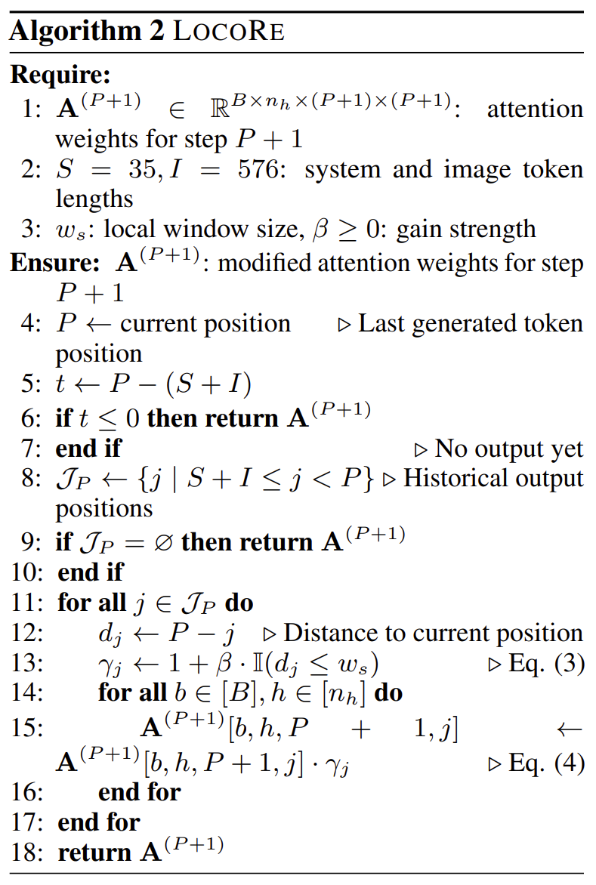
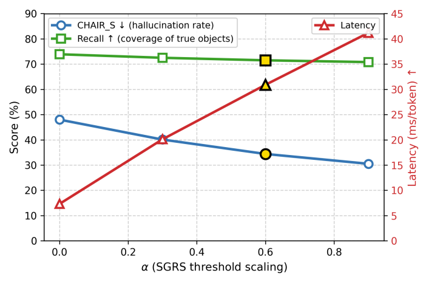

## Hallucination Begins Where Saliency Drops

在幻觉缓解领域中，早期的方法往往缺乏幻觉的成因，导致解释性较差，且对外部知识和额外计算开销较大。现有的基于注意力的方法并不能十分可靠地区分幻觉和正确输出，作者认为这是因为其只使用前向传递的attention，而忽略了**梯度**所隐含的信息。文章提出了一种融合传统attention和梯度信息的检测工具，来检测每个token的“强度”，并且作者推断如果先前输出的tokens对于下个token的预测有着较小的**saliency 显著性**，就发生了幻觉。据此作者提出相应的缓解方法。

### “知识聚合模式”背后的真相
现有的注意力干涉方法中，认为当一个token有着较高的attention权重时，这种over-trust / over-reliance可能会导致丧失对先前token的关注，进而造成幻觉。但attention和幻觉的关系并没有被很好地解释，是因为将attention可视化为热力图之后，只能反映模型在推理过程中的选择，而没有揭示输入tokens的变化是如何影响最终输出的。作者抓住了被现有方法广泛忽视的**gradient information 梯度信息**，这对理解生成过程中的tokens之间的关系是很重要的。
在某些attention中没有出现“聚合模式”但仍然出现幻觉，作者认为要更进一步发掘幻觉产生的原因(why and where)，而不是仅仅知道什么时候发生了幻觉(when)。
为什么会发生“知识聚合”呢？
在这里要介绍一个概念——**information flow 信息流**，其被提出于2023年的文章“Label Words are Archors”中。information flow的含义是，一个token对另一个token预测的影响程度，可以使用梯度视角分析，即$\frac{\partial P(Y)}{\partial X}$，也可以从注意力的token间的“关注度”视角分析。
从梯度视角得到启发，作者同时考量attention权重的内积和梯度，定义一种非监督的指标——LVLMs-Saliency，用来衡量生成当前token时先前token的影响。
根据LVLMs-Saliency，观测到不同于传统Attention Heat Map的模式，如下图所示：

作者认为，**如果当前token难以维持对先前token的saliency，可能会出现语义上的幻觉**。
在这张图中，值得注意的是，正确和幻觉token对于system和prompt token的依赖都很低，作者通过实验说明，system和prompt虽然对模型的结果产生影响，但并不是产生幻觉的主要原因。

### SGRS and LocoRE
作者根据saliency提出了一套由SGRS和LocoRE配合而成的幻觉缓解机制，其中Saliency-Guided Rejection Sampling起到阻止选择低saliency的作用，而Local Coherence Reinforcement 在token **commitment 选定**之后，起到强化上下文依赖的作用。

首先将模型生成token的过程形式化地表示如下：
$$
\mathcal{M}(x) = (y, \{\mathbf{A}^{(l,h)}\}_{l=1,h=1}^{L,H}, s)
$$
其中$x$是输入序列，$s$是模型输出的logits分布，$y$是预测词汇的概率分布，而$\{\mathbf{A}^{(l,h)}\}_{l=1,h=1}^{L,H}$表示不同层的不同“头”的Attention权重。
有损失函数如下：
$$
\mathcal{L}(y,s)=\sum_{t=1}^T y_t \log \sigma(s_t)
$$
进而得到梯度表示：
$$
\nabla \mathbf{A}^{(l,h)}=\frac{\partial \mathcal{L}}{\partial \mathbf{A}^{(l,h)}} \in \mathbb{R}^{n \times n}
$$
定义saliency如下：
$$
\mathbf{S}^{(l,h)} = \text{tril}(|\mathbf{A}^{(l,h)}\odot \nabla \mathbf{A}^{(l,h)}|)
$$
其中$\text{tril}(\cdot)$表示取下三角矩阵，$\odot$表示逐元素相乘。
对同一层的多个“头”的saliency进行整合：
$$
\bar{\mathbf{S}}^{(l)} = \frac{\sum_{h=1}^H \mathbf{S}^{(l,h)}}{ \| \sum_{h=1}^H \mathbf{S}^{(l,h)}\|_2}
$$
以上是关于saliency的基础定义，下面进入方法部分。
**SGRS**的目的是拒绝saliency过低的tokens，因此要定义在生成第$P$个token时，对其中一个候选token $c$的saliency评分如下：
$$
\mathbf{S}(c) = \frac{1}{|\mathcal{L}_{\text{traget}}|\cdot|\mathcal{J}|}\sum_{l\in\mathcal{l}_{\text{target}}}\sum_{j\in\mathcal{J}}\bar{\mathbf{S}}_{P,j}^{(l)}
$$
其中$\mathcal{L}_{\text{target}}$是进行筛选的层，如从中层到深层，而$\mathcal{J}=\{j|\text{Sys}_L+\text{Img}_L \le j < P\}$表示先前生成的tokens下标。
下面讨论筛选阈值，作者给出一种自适应的方式，形式化地表示如下：
$$
\tau^{(P)}=\alpha\cdot\frac{1}{|\mathcal{H}|}\sum_{j\in\mathcal{H}}\mathbf{S}(x_j)
$$
其中$\mathcal{H}=\{j\in \mathcal{J} | (P-1)-W\le j \le (P-1)\}$表示最近前$W$个tokens的平均$\text{saliency}$。
综上，只有$\mathbf{S}(c)>\tau^{(P)}$的tokens才会被考虑，而如果所有tokens都不符合要求，则选择评分最大的token。SGRS的伪代码如下图所示。

SGRS保证了token级别的上下文关联，而LocoRE则通过增强当前token对于先前输出tokens的依赖，解决句子级别的**context drift 上下文偏移**。形式化的有如下表述：
$$
\gamma_j^{(P)} = 1 + \beta \cdot \mathbb{I}((P - j) \le w_s)
$$
其中$\beta$表示增强强度，$\mathbb{I}(\cdot)$是**指示器函数**，即满足条件即为$1$，否则为$0$。
进一步增强第$P+1$个token对先前token的attention，即对于$\forall b \in[B], \, h \in [n_h], \, j \in \mathcal{J}$，有
$$
\mathbf{A}^{(P+1)}[b, h, P+1, j] \leftarrow \mathbf{A}^{(P+1)}[b, h, P+1, j] \cdot \gamma_j^{(P)}
$$
其中$B$表示batch，$n_h$表示“头”的个数。
也可使用向量的形式表示为：
$$
\mathbf{A}^{(P+1)}_{P+1, \mathcal{J}_P} \leftarrow \mathbf{A}^{(P+1)}_{P+1, \mathcal{J}_P} \odot \boldsymbol{\gamma}^{(P)} 
$$
其中$\odot$表示在batch和head维度上进行广播后，逐元素相乘。
得到增强后的attention会进一步经过softmax和自注意力机制中的加权求和等步骤，进而使得对$P+1$个token的预测更加基于近期生成的tokens。LocoRE整体过程如下。

值得注意的是，SGRS结合梯度进行采样，而在LocoRE过程中并没有使用到梯度，而只是基于attention结构修改了权重。

### Experiments
作者对$\alpha$的取值进行分析，得到其对推理延迟和表现影响如下图。

