## Look Twice

> When the memory of an image seen the moment before is forgotten, people will look at it again for factual answers.

在这篇文章中，作者提出了一种名为类似`key-values memory`的视觉追溯方法 **visual retracing**，具有不额外增加计算量、即插即用、不影响通用能力的特点。

### Uncertainty 与幻觉的关系
在一次预测中，模型往往对于如问题中提到的token、功能性的token等，这些容易预测的tokens有着十足的把握，从`middle layers`开始就保持相对稳定的分布，但对于难以确定的tokens则会有着较高的uncertainty，同时伴随着最后几层分布的变动，这tokens也更容易出现幻觉。

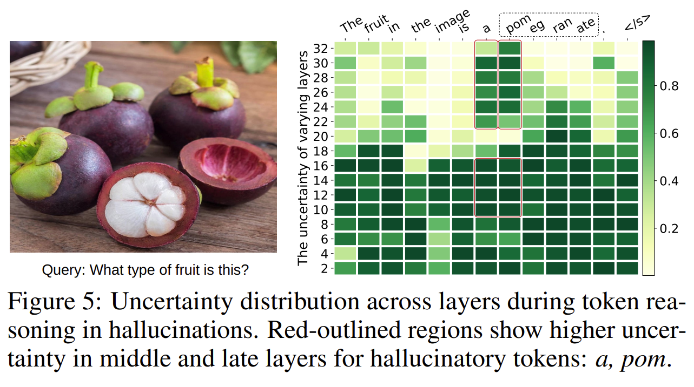

### “amnesia” 失忆症
文章指出，**从`shallow layers`到`deep layers`的过程中，`attention`会逐步地偏向文本tokens，因此视觉tokens会更难影响结果**。这一问题也在`attention intervention strategies`的研究中被证明确实存在。
针对这一问题，除了直接操控`attention`的方式，也可以使用`visual tokens`增强的方式，在`uncertainty`较高时，**`refresh visual memory`** 可以减缓幻觉，同时作者也对`replenish test / image`分析，发现只有`replenish image`表现最好，这也再次说明了问题切实存在且方法有效。

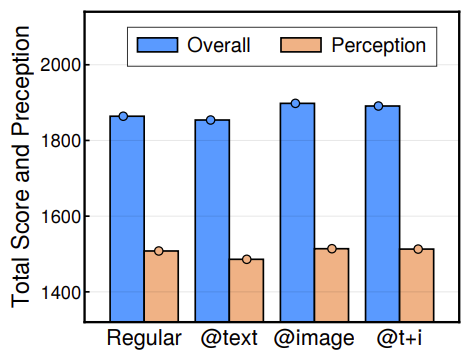

### FFN —— “key-value memory”
最常见的`feed forward network`，由两个全连接层和中间的激活函数构成，可表示如下：
$$ FFN(x) = \phi (x W_1) {W_2^T}$$
其中$ x \in \mathbb{R}^d$，$ W_1, W_2 \in \mathbb{R}^{d\times D}$，$D$通常取$4d$。
可以将上面的`FFN`，改写成`key-value`的形式：
$$FFN(x) = \sum_{i = 1}^{D} \phi( \langle x, k_i \rangle)v_i$$
上式中的求和实际上表示按顺序组成一个向量，作为`key-value`的$k_i$和 $ v_i$ 实际上如下图所示：

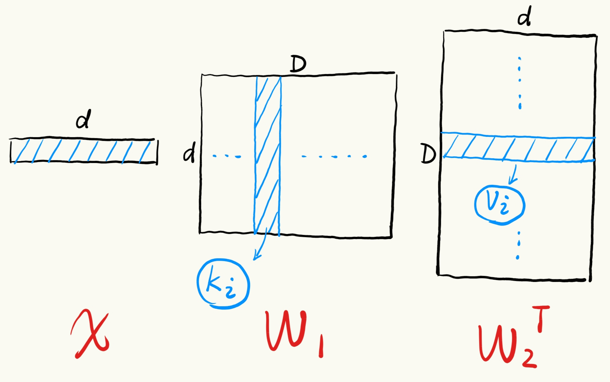

### Visual Retracing 视觉追溯

类似于FFN从其 `key-value memory` 进行检索，可以对视觉依据进行重新检索，即将视觉tokens作为key和value，来提供视觉有关信息。这就是**visual retracing**方法，具体可以形式化地表示如下：
$$
VR(z_v | x) = \sum_{i=1}^{N_z} \phi(\langle x, z_{v,i} \rangle)z_{v,i}
$$
其中$z_v = (z_{v,1}, \ldots, z_{v,N_v}) \in \mathbb{R} ^ {d \times N_z}$表示视觉tokens。
最终，和原始FFN整合：
$$
FFN^{(l)}(x \propto z_v)
= \alpha VR(z_v | x) + (1 - \alpha) FFN^{(l)}(x),
$$
这种使用`key-value`的检索方式，相较使用`cross-attention layer`方式开销要更小。 
### Dynamic or Static Triggered VR
为了使VR发挥出最大效果，需要根据tokens动态地选择是否使用VR，以及使用VR的层也要动态选择，而uncertainty就起到动态选择基准的作用。 

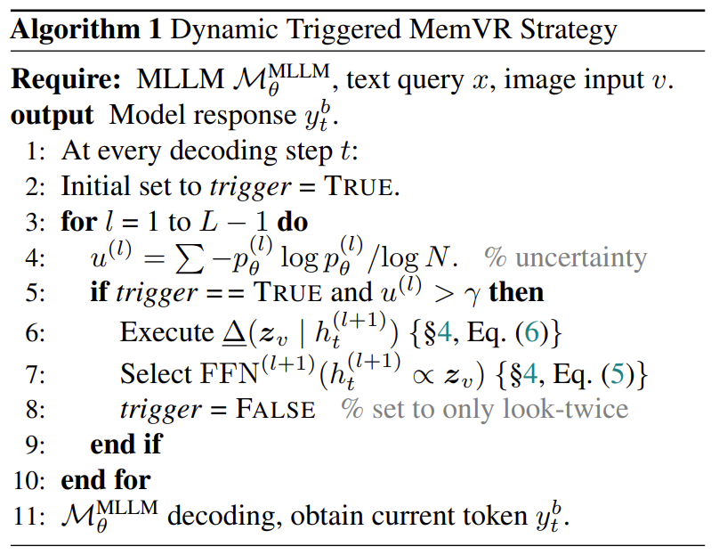

也可考虑静态的VR方法，即通过在验证集上，对所有可能层进行实验，最终选择有最好平均成绩的层，作为静态的`trigger layer`。
最终实验结果如下：

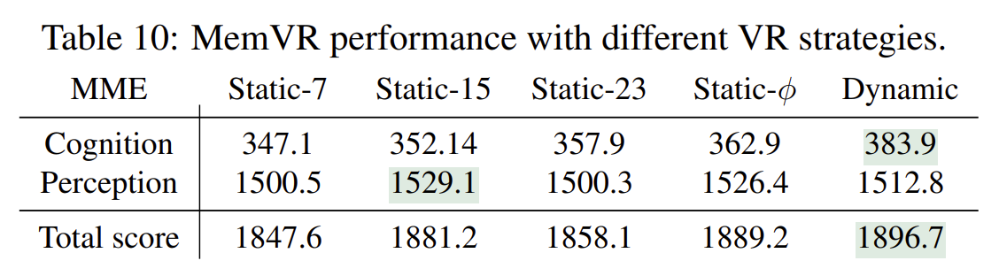

VR方法和其他常用方法对比如下：

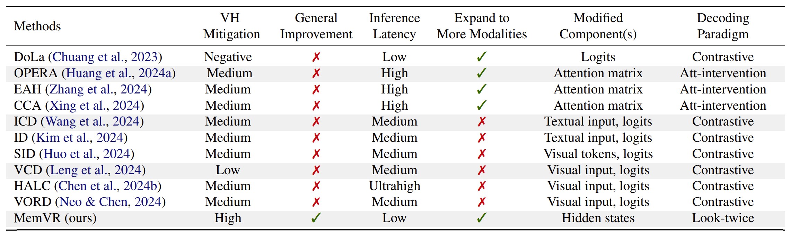

这些方法虽然对幻觉有缓解作用，但会对模型的其他能力和泛化性有一些影响，而实验证明，VR对模型的通用能力也有提升。

如，VR与regular / VCD在 ` LLaVA-Bench (in-the-wild) ` 上表现的对比。

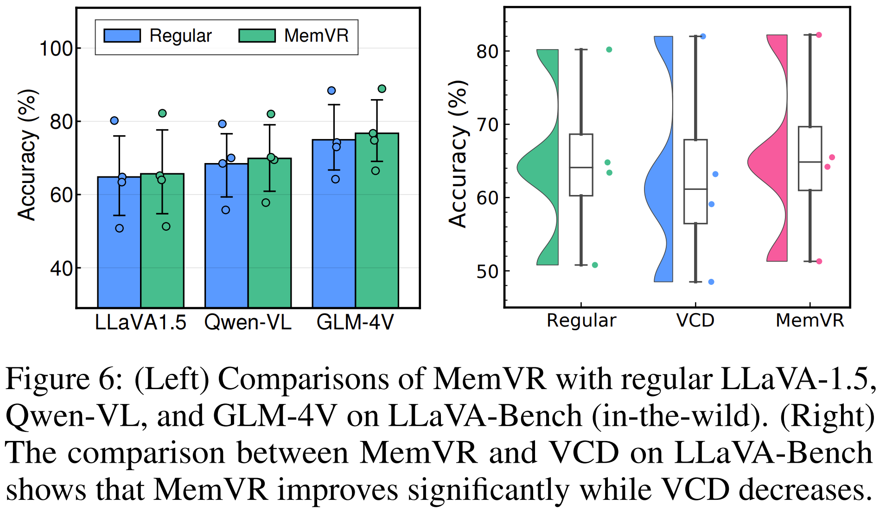

且VR在推理延迟、内存开销上有着充分的优势：

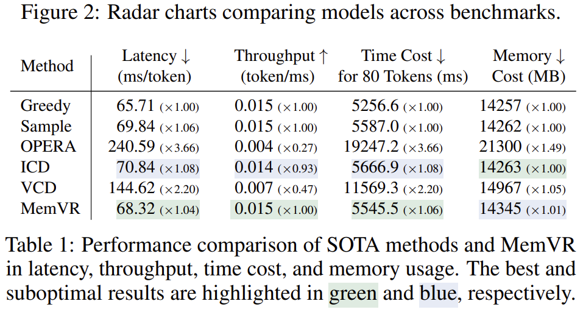

### 理论分析

### 实验
作者在`POPE benchmark`/`CHAIR`/`VizWiz-VQA`/`MME`/`MMBench`/`MM-Vet`/`LLaVA-Bench`/`HallusionBench`数据集上进行实验。

在`POPE benchmark`，VR方法表现稳定且优秀：

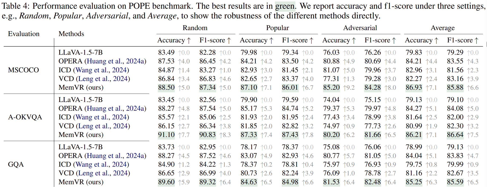

在消融实验中，针对VR触发条件$\gamma$和视觉注入率$\alpha$进行分析发现，当$\gamma \approx 0.75$时效果最好，原因是如果$\gamma$过小，则会在浅层时触发，无法很好地影响最终结果，而$\gamma$过大则难以触发。对于$\alpha$来说，在$5\% \sim 35\%$之间会提升表现，而超过$35\%$就会降低表现，这表明`visual memory`对模态平衡的支持有一个上界。

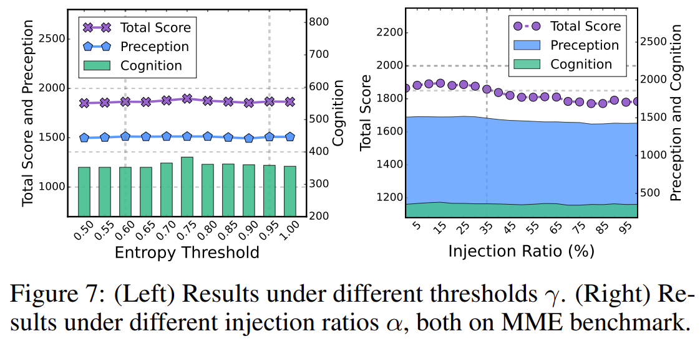

同时通过令$\alpha = 2 (u - \gamma)$可以简化掉一个超参数，并实现动态的注入率。

对于动态和静态的`visual retracing`的不同层的影响，实验分析如下：

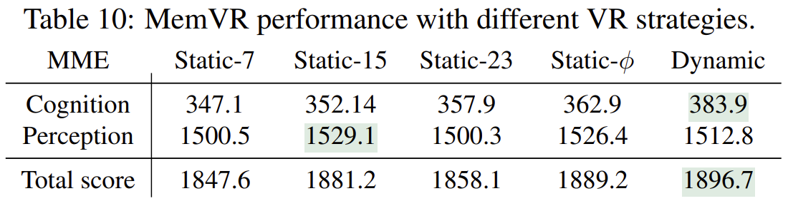
